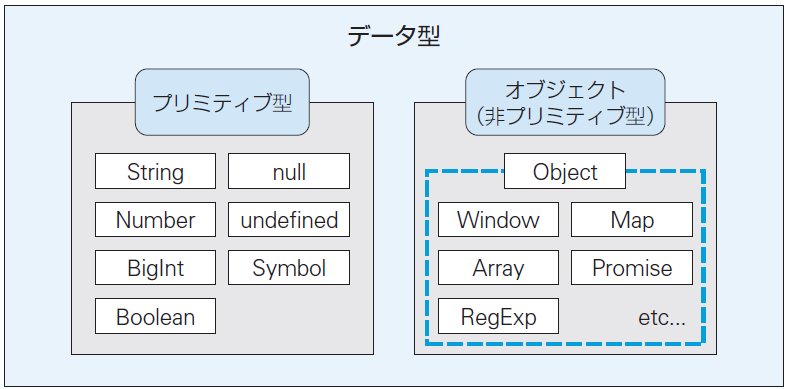

<link rel="stylesheet" href="https://stackpath.bootstrapcdn.com/bootstrap/4.1.3/css/bootstrap.min.css" integrity="sha384-MCw98/SFnGE8fJT3GXwEOngsV7Zt27NXFoaoApmYm81iuXoPkFOJwJ8ERdknLPMO" crossorigin="anonymous">

## 独習JavaScript 新版
### Chapter1　イントロダクション
### Chapter2　JavaScript開発の基礎
### Chapter3  変数とデータ型
### Chapter4　演算子
### Chapter5　制御構文
### Chapter6　関数
### Chapter7　スコープ
### Chapter8　thisキーワード
### Chapter9　クラス
### Chapter10　組み込みオブジェクト
### Chapter11　コレクション
### Chapter12　反復処理
### Chapter13　非同期処理
### Chapter14　DOM
### Chapter15　イベント
### Chapter16　モジュール
### Chapter17　Node.js
<br>


### Chapter1　イントロダクション
3.1 変数
3.2 変数と定数
  3.2.1 変数宣言
  3.2.2 変数の本質 レベルアップ
  3.2.3 値の再代入
  3.2.4 変数のコピー
  3.2.5 定数
3.3 識別子の命名規則
3.4 データ型
3.5 プリミティブ型
3.6 オブジェクト
3.7 JavaScriptのデータ型の特徴


### Chapter2　JavaScript開発の基礎
### Chapter3  変数とデータ型
### Chapter4　演算子
### Chapter5　制御構文
### Chapter6　関数
### Chapter7　スコープ
### Chapter8　thisキーワード
### Chapter9　クラス
### Chapter10　組み込みオブジェクト
### Chapter11　コレクション
### Chapter12　反復処理
### Chapter13　非同期処理
### Chapter14　DOM
### Chapter15　イベント
### Chapter16　モジュール
### Chapter17　Node.js
<br>

---

### Chapter1　イントロダクション
`...一旦飛ばし...`
<br>

### Chapter2 JavaScript開発の基礎
`...一旦飛ばし...`
<br>

### Chapter3　変数とデータ型
#### 3.4 データ型
##### <u>3.4.1 データ型の種類</u>
JavaScriptで使用可能なデータ型には以下の**8種類**のデータ型があります。
| No | データ型   | 値 | 説明
|--|--|--|--
|  1 | String    | 文字列       | シングルクォート（'）、ダブルクォート（"）、バッククォート（`）で囲んだ文字列
|  2 | <font color="red">Number</font>    | 数値         | 「-(2<sup>53</sup> - 1)」 ～ 「2<sup>53</|  sup> - 1」 の数値（整数または浮動小数点数）<br>※2<sup>53</sup> - 1 = 9007199254740991
|  3 | <font color="red">BigInt</font>    | 巨大な整数   | 任意の大きさの整数値
|  4 | Boolean                            | 真偽値       | true / false
|  5 | null                               | ヌル         | null<br>※値が空（存在しない）ことを表します。
|  6 | undefined                          | 未定義       | undefined<br>※値が未定義であることを表します。
|  7 | <font color="red">Symbol</font>    | シンボル     | 一意で不変な値
|  8 | <font color="red">Object</font>    | オブジェクト | キーと値を対で格納する入れ物

変数に格納される値は、上記のいずれかの型に一致することになります。

また、これら8つのデータ型は、大きく次の<u>2つに分類</u>されます（図3.10）。
* **プリミティブ型**　： オブジェクト以外のデータ型
* **非プリミティブ型**：（複合型） オブジェクト


| 種類 | 参照を持つ？ | 例
| -- | -- | --
| プリミティブ | ❌ 持たない | Number, String, Boolean など
| オブジェクト | ✔ 持つ | Array, Object, Function など
| プリミティブのメソッド呼び出し | ✔ 一時的にラッパーオブジェクトが生成される | `123.toFixed()`

* プリミティブは参照を持たない → 値そのもの
　メソッド呼び出し時だけ一時的に参照型になる（ボクシング）
* オブジェクトは常に参照を持つ → 参照渡しになる
<br>

##### <u>3.4.2 リテラル</u>

* **文字列リテラル（シングル・ダブル・バッククウォートで囲う）**
  <font color="red">テンプレートリテラル</font>
  ```js
  `こんにちは ${name}`　// バッククウォートの場合のみ、${変数名}を埋め込める。
  ```
* **数値リテラル**
* **BigIntリテラル**
  ```js
  1234567890n　// 末尾にnを付与する`
  ```
* **真偽値リテラル**
* **nullリテラル**
* **オブジェクトリテラル**
    ```js
  {
        name: "独習太郎",
  　　　age: 15
  }
    ```
* **配列リテラル**
  ```js
  [0, 1, 2, 3, 4, 5, 6, 7, 8, 9]
  ```
* **正規表現リテラル**
  ```js
  /ab+c/
  ```
* **関数リテラル**
  ```js
  let abc = function() {
    // ...
  }
  ```
<br>


#### 3.5 プリミティブ型

##### <u>3.5.1 文字列（String）</u>
* **「シングルクウォート(')」** or **「ダブルクウォート(")」** or **「バッククウォート(`)」** で囲う
* <u>プラス(+)演算子</u>で**文字列を結合**できる
* <u>バックスラッシュ(\\) </u>に続く特殊な文字列を**エスケープシーケンス**と呼ぶ
* <u>バッククウォート(`) </u>の場合のみ、文字列に「${変数名}」を埋め込める（**テンプレートリテラル**）

##### <u>3.5.2 数値（Number）</u>
* **10進数**
* **2進数（0b、0B）**
* **8進数（0o、0O）**
* **16進数（0x、0X）**
* **数値計算に使用可能な演算子（ +　-　\*　/　%　\*\* ）**

##### <u>3.5.3 BigInt</u>
* 任意の制度で<u>整数値</u>を扱える型（Number型では表せない値の範囲を表現できる）
* Number型は、その範囲を超える場合には<u>値が丸めこまれる</u>
* BigInt型とNumber型は<u>混在して使用できない</u>（エラー）
* BigInt型はあくまで整数値を表す型のため、小数点以下の値は<u>切り捨てられる</u>

##### <u>3.5.4 真偽値（Boolean）</u>
* 等価性（ === または == ）

##### <u>3.5.5 null</u>
* nullは参照を保持していないことを表す
* 「変数(の参照)が空である」ことを<u>意図的に</u>表す特別なリテラル

##### <u>3.5.6 undefined</u>
* undefinedは変数が<u>未定義</u>であることを表す
* 変数宣言時に値を代入しない場合、undefinedがプログラムによって<u>自動的に</u>設定される
* nullは基本的に<u>明示的に</u>設定しない限り、変数に設定されることはない
<br><br>


#### 3.6 オブジェクト

##### <u>3.6.1 オブジェクトの初期化</u>


<br>

##### <u>3.6.2 ドット記法</u>


<br>

##### <u>3.6.3 ブラケット記法</u>


<br>

##### <u>3.6.4 プロパティの削除</u>


<br>

##### <u>3.6.5 メソッド</u>


<br>

##### <u>3.6.6 シンボル（Symbol） レベルアップ 初心者はスキップ可能 使用頻度低</u>


<br><br>

#### 3.7 JavaScriptのデータ型の特徴

##### <u></u>


<br>

##### <u></u>


<br>

##### <u></u>


<br>

##### <u></u>


<br>

##### <u></u>


<br>

##### <u></u>


<br><br><br><br><br><br><br><br><br><br><br><br><br><br><br><br><br><br><br><br><br>
【参考】
🎯 まずは最小構成（ESLint + Prettier）
```json
{
  "env": {
    "browser": true,
    "es2021": true
  },
  "extends": [
    "eslint:recommended",
    "plugin:prettier/recommended"
  ],
  "parserOptions": {
    "ecmaVersion": "latest",
    "sourceType": "module"
  },
  "rules": {
    "no-unused-vars": "warn",
    "no-undef": "error"
  }
}
```

🎯 定数名の命名規則を強制する設定（重要）
✔ 通常の const → lowerCamelCase
✔ 不変の定数 → UPPER_SNAKE_CASE
を ESLint で強制するには id-match を使います。
```json
{
  "rules": {
    "id-match": [
      "error",
      "^[a-z][a-zA-Z0-9]*$|^[A-Z0-9_]+$",
      {
        "onlyDeclarations": true
      }
    ]
  }
}
```
このルールの意味
- userName → OK
- maxItems → OK
- API_BASE_URL → OK
- DEFAULT_TIMEOUT → OK
- UserName（先頭大文字）→ NG
- apiBaseUrl（不変値なのに camelCase）→ NG
→ チーム全体で命名規則がブレなくなる

🎯 さらに実務でよく使うルールセット
あなたの開発スタイル（保守性・可読性重視）に合う構成をまとめるとこうなります。
```json
{
  "env": {
    "browser": true,
    "es2021": true
  },
  "extends": [
    "eslint:recommended",
    "plugin:@typescript-eslint/recommended",
    "plugin:prettier/recommended"
  ],
  "parser": "@typescript-eslint/parser",
  "parserOptions": {
    "ecmaVersion": "latest",
    "sourceType": "module"
  },
  "plugins": ["@typescript-eslint"],
  "rules": {
    "@typescript-eslint/no-unused-vars": "warn",
    "@typescript-eslint/no-explicit-any": "warn",
    "no-console": "warn",
    "eqeqeq": ["error", "always"],
    "id-match": [
      "error",
      "^[a-z][a-zA-Z0-9]*$|^[A-Z0-9_]+$",
      { "onlyDeclarations": true }
    ]
  }
}
```
🧭 まとめ
- 定数名は小文字が一般的ではなく、用途で使い分けるのが正解
- ESLint の id-match を使えば命名規則を強制できる
- TypeScript + Prettier の構成が現代の標準
- あなたの開発スタイルなら「保守性重視のルールセット」が最適


🎯 まとめ（迷ったらこれ）
| 用途                  | 主流の命名規則
|--|--
| 変数名                | camelCase
| 関数名                | camelCase
| クラス名（JSのclass） | PascalCase
| 不変の定数            | UPPER_SNAKE_CASE
| API / JSON フィールド | snake_case（外部仕様に従う）
| CSS クラス名          | kebab-case


